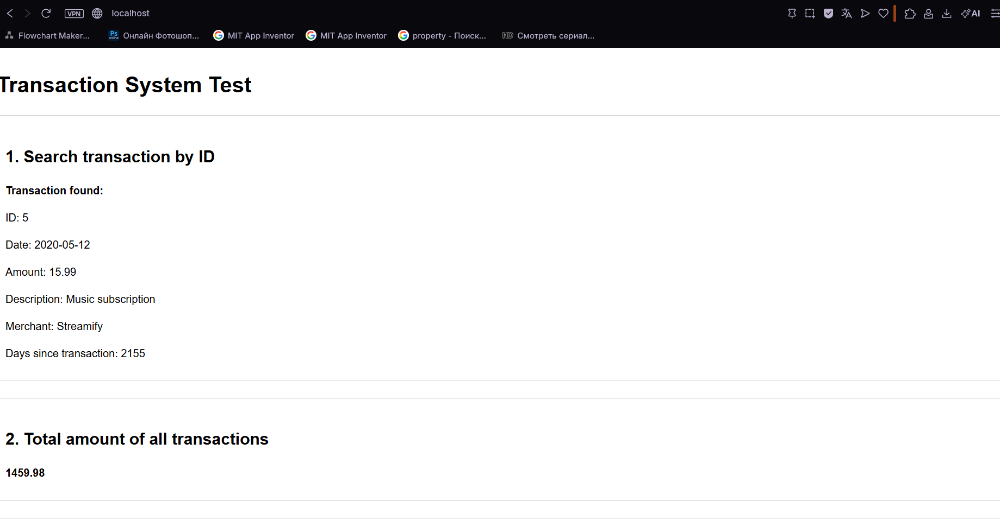

# Лабораторная работа №6

## Взаимодействие контейнеров (nginx + php-fpm)

## Цель работы

Научиться запускать несколько контейнеров и настраивать их взаимодействие между собой без использования docker-compose.

## Задание

Нужно было поднять php-приложение на основе двух контейнеров:

- nginx (frontend)
- php-fpm (backend)

При этом нельзя использовать docker-compose.

## Ход выполнения

### 1. Клонирование репозитория

Cкачал в репозиторий контейнера репозиторий с готовыми лабораторными по PHP:

```bash
git clone https://github.com/AndreiKlinchev/PHP-labs.git
```

### 2. Переход в нужную ветку

Перешёл в папку проекта и переключился на ветку main:

```bash
cd .\PHP-labs\
git switch main
```

Там лежат все выполненные лабораторные.

### 3. Копирование сайта

Скопировал нужную лабораторную `phpLab5` в папку mounts/site:

```bash
cp -r .\PHP-labs\phpLab5\- .\mounts\site\
```

Эта папка потом будет подключаться к контейнерам как `volume`.

### 4. Создание сети Docker

Создал отдельную сеть для контейнеров:

```bash
docker network create internal
docker network ls

NETWORK ID     NAME       DRIVER    SCOPE
87b2349c7d0b   internal   bridge    local
```

Проверил, что сеть появилась.

### 5. Запуск backend (php-fpm)

Запустил контейнер с PHP:

```bash
docker run -d --name backend --network internal -v ./mounts/site/:/var/www/html php:8.4-fpm
```

> Контейнер пришлось строить на более новой версии php поскольку версия php:7.4-fpm не поддерживает модификаторы доступа в конструкторах класса.

Контейнер:

- подключён к сети internal
- видит файлы сайта
- обрабатывает PHP

### 6. Запуск frontend (nginx)

Запустил nginx:

```bash
docker run -d --name frontend --network internal -v ./mounts/site/:/var/www/html -v ./nginx/default.conf:/etc/nginx/conf.d/default.conf -p 80:80 nginx:1.23-alpine
```

Тут:

- подключён тот же volume
- подключён конфиг nginx
- проброшен порт 80

### 7. Настройка nginx

Создал файл `nginx/default.conf`:

```nginx
server {
    listen 80;
    server localhost;
    root /var/www/html;
    index index.php;

    location / {
        try_files $uri $uri/ /index.php?$args;
    }

    location ~ \.php$ {
        fastcgi_pass backend:9000;
        fastcgi_index index.php;
        fastcgi_param SCRIPT_FILENAME $document_root$fastcgi_script_name;
        include fastcgi_params;
    }
}
```

### 8. Проверка

Открыл в браузере:

```http
http://localhost
```



## Ответы на вопросы

### 1. Как контейнеры взаимодействуют?

Контейнеры взаимодействуют через docker-сеть `internal`.

nginx отправляет запросы в php-fpm через FastCGI.

### 2. Как контейнеры видят друг друга?

Они видят друг друга по именам контейнеров.

Например:

- backend доступен как `backend`
- frontend как `frontend`

### 3. Почему нужно было менять конфиг nginx?

Потому что nginx по умолчанию не умеет обрабатывать PHP.

Он просто отдаёт файлы.

Чтобы PHP работал, нужно было:

- добавить fastcgi
- указать backend

## Вывод

В ходе работы мы:

- подняли два контейнера
- настроили сеть между ними
- связал nginx и php-fpm
- запустил php-сайт

Научились поднимать несколько взаимодействующих между собой контейнеров.
